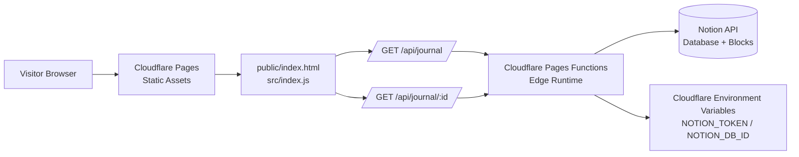
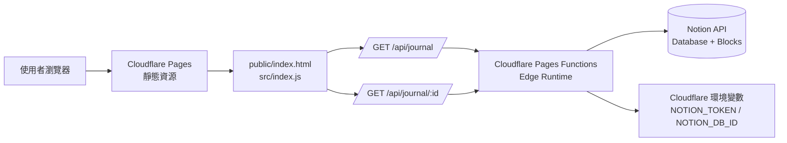

# Notion Journal Profile

[English](#english) | [繁體中文](#繁體中文)

---

## English

### Overview

Notion Journal Profile is a lightweight portfolio and journal site designed for deployment on **Cloudflare Pages with Pages Functions**. The static frontend is served from the `public/` directory, while serverless API endpoints run at the edge and proxy requests to the Notion API. This keeps Notion credentials out of the browser and provides a clean public API for rendering journal metadata and entry content.

### Architecture



### Technical Implementation

#### Frontend

- `public/index.html` provides the browser entry point, static UI, client-side rendering logic, journal card formatting, and entry loading interactions.
- `public/icon.jpg` is served as a static image asset for the site.
- Static assets are served directly by Cloudflare Pages or Cloudflare Workers Assets for low-latency global delivery.

#### Edge API Layer

- `functions/api/journal.js` exposes `GET /api/journal` for Cloudflare Pages Functions and queries the configured Notion database.
- `functions/api/journal/[id].js` exposes `GET /api/journal/:id` for Cloudflare Pages Functions and fetches child blocks for an individual Notion page.
- `functions/_shared/notion.js` stores shared Notion constants used by the Pages Functions.
- `src/index.js` is the Cloudflare Worker entry configured by `wrangler.jsonc`; it serves `public/` through the `ASSETS` binding and runs worker-first API handling for `/api/*`.
- API responses include CORS headers and UTF-8 content types to support browser consumption and multilingual content.

#### Notion Integration

The application reads journal data from a Notion database. The expected database properties are:

| Property | Type | Purpose |
| --- | --- | --- |
| `標題` | Title | Journal entry title |
| `日期` | Date | Entry date and sorting key |
| `Mood` | Select | Mood label shown in the UI |
| `Energy` | Select | Energy label shown in the UI |
| `Tags` | Multi-select | Entry categorization |

The list endpoint sorts entries by `日期` in descending order. The detail endpoint converts supported Notion block types into safe HTML for display, including paragraphs, headings, ordered lists, bulleted lists, links, rich-text annotations, and images where supported by the implementation.

### Deployment: Cloudflare Pages + Pages Functions

This project can be deployed with Cloudflare Pages and Pages Functions, or through the Cloudflare Worker configuration in `wrangler.jsonc` that serves `public/` as Worker assets and routes `/api/*` through the Worker first.

1. Create a Cloudflare Pages project and connect this repository.
2. Configure the production branch.
3. Set the build and output settings according to your Pages project setup. If no bundling step is required, serve the static site from `public/`. For Worker-based deployment, use `wrangler.jsonc`, where `main` points to `src/index.js` and the asset directory points to `./public`.
4. Add the required environment variables in Cloudflare Pages:

| Variable | Required | Description |
| --- | --- | --- |
| `NOTION_TOKEN` | Yes | Internal Notion integration token. |
| `NOTION_DB_ID` | Yes | Notion database ID used for journal entries. |
| `NOTION_VERSION` | No | Notion API version. Defaults to `2022-06-28`. |
| `ALLOWED_ORIGIN` | No | CORS origin. Defaults to `*` when not set. |

5. Deploy the project. Cloudflare will serve static files and route `/api/*` requests to the edge API layer before falling back to static assets.

### Security Notes

- Never expose `NOTION_TOKEN` in frontend code.
- Store all secrets in Cloudflare Pages environment variables.
- Restrict `ALLOWED_ORIGIN` to the production domain when possible.
- Keep the Notion integration scoped only to the database required by this application.

### Local Development

Use Wrangler or the Cloudflare Pages development workflow to run the static site and functions locally. Ensure the same environment variables are available locally before testing API routes.

Example environment values:

```bash
NOTION_TOKEN=secret_xxx
NOTION_DB_ID=xxxxxxxxxxxxxxxxxxxxxxxxxxxxxxxx
NOTION_VERSION=2022-06-28
ALLOWED_ORIGIN=http://localhost:8788
```

---

## 繁體中文

### 專案概述

Notion Journal Profile 是一個輕量化的作品集與日誌網站，設計目標是部署在 **Cloudflare Pages 搭配 Pages Functions**。靜態前端由 `public/` 目錄提供，Serverless API 則在 Cloudflare Edge Runtime 執行，並作為瀏覽器與 Notion API 之間的安全代理層。此架構能避免 Notion 金鑰暴露在前端，同時提供穩定且清晰的公開 API 來呈現日誌列表與內容。

### 架構圖



### 技術實現

#### 前端層

- `public/index.html` 是瀏覽器載入的入口頁面，包含靜態 UI、用戶端渲染邏輯、日誌卡片格式化與內容載入互動。
- `public/icon.jpg` 作為網站的靜態圖片資源。
- 靜態資源可由 Cloudflare Pages 或 Cloudflare Workers Assets 直接提供，透過 Cloudflare 全球網路降低延遲並提升可用性。

#### Edge API 層

- `functions/api/journal.js` 為 Cloudflare Pages Functions 提供 `GET /api/journal`，用來查詢已設定的 Notion Database。
- `functions/api/journal/[id].js` 為 Cloudflare Pages Functions 提供 `GET /api/journal/:id`，用來取得單篇 Notion Page 的子區塊內容。
- `functions/_shared/notion.js` 放置 Notion 相關共用常數，供 Pages Functions 使用。
- `src/index.js` 是 `wrangler.jsonc` 設定的 Cloudflare Worker 入口；它透過 `ASSETS` binding 提供 `public/` 靜態檔案，並優先處理 `/api/*` API 請求。
- API 回應包含 CORS 標頭與 UTF-8 Content-Type，以支援瀏覽器存取與多語內容顯示。

#### Notion 整合

本專案從 Notion Database 讀取日誌資料。建議的資料庫欄位如下：

| 欄位 | 類型 | 用途 |
| --- | --- | --- |
| `標題` | Title | 日誌標題 |
| `日期` | Date | 日誌日期與排序依據 |
| `Mood` | Select | 顯示於介面的心情標籤 |
| `Energy` | Select | 顯示於介面的能量標籤 |
| `Tags` | Multi-select | 日誌分類標籤 |

列表 API 會依照 `日期` 由新到舊排序。內容 API 會將支援的 Notion block 轉換為安全的 HTML，包含段落、標題、有序清單、無序清單、連結、富文字樣式，以及實作支援的圖片區塊。

### 部署方式：Cloudflare Pages + Pages Functions

本專案可使用 Cloudflare Pages 搭配 Pages Functions 部署，也可使用 `wrangler.jsonc` 中的 Cloudflare Worker 設定部署；Worker 會將 `public/` 作為靜態資產來源，並讓 `/api/*` 優先進入 Edge API 層處理。

1. 建立 Cloudflare Pages 專案並連接此 repository。
2. 設定 production branch。
3. 依照 Pages 專案需求設定 build 與 output。若不需要額外打包流程，可直接以 `public/` 作為靜態輸出目錄。若採 Worker 部署，則使用 `wrangler.jsonc`，其中 `main` 指向 `src/index.js`，asset directory 指向 `./public`。
4. 在 Cloudflare Pages 中新增必要環境變數：

| 變數 | 必填 | 說明 |
| --- | --- | --- |
| `NOTION_TOKEN` | 是 | Notion Internal Integration Token。 |
| `NOTION_DB_ID` | 是 | 作為日誌來源的 Notion Database ID。 |
| `NOTION_VERSION` | 否 | Notion API 版本，預設為 `2022-06-28`。 |
| `ALLOWED_ORIGIN` | 否 | CORS 允許來源，未設定時預設為 `*`。 |

5. 部署專案。Cloudflare 會提供靜態檔案，並將 `/api/*` 請求先路由至 Edge API 層，再於非 API 路徑回退至靜態資產。

### 安全性注意事項

- 請勿將 `NOTION_TOKEN` 寫入或暴露於前端程式碼。
- 所有敏感資訊都應存放於 Cloudflare Pages 的環境變數中。
- 正式環境建議將 `ALLOWED_ORIGIN` 限制為 production domain。
- Notion Integration 權限應只授予此專案需要讀取的 Database。

### 本機開發

可使用 Wrangler 或 Cloudflare Pages 的本機開發流程啟動靜態網站與 Functions。測試 API routes 前，請確認本機環境已設定與正式環境相同的必要變數。

環境變數範例：

```bash
NOTION_TOKEN=secret_xxx
NOTION_DB_ID=xxxxxxxxxxxxxxxxxxxxxxxxxxxxxxxx
NOTION_VERSION=2022-06-28
ALLOWED_ORIGIN=http://localhost:8788
```
